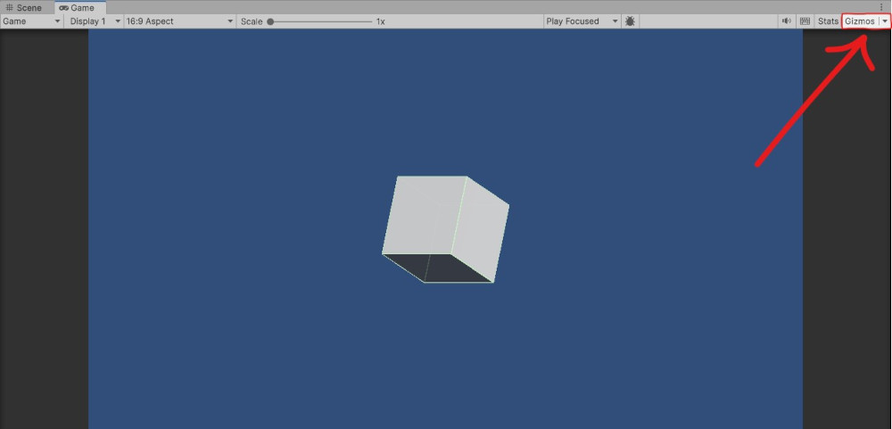
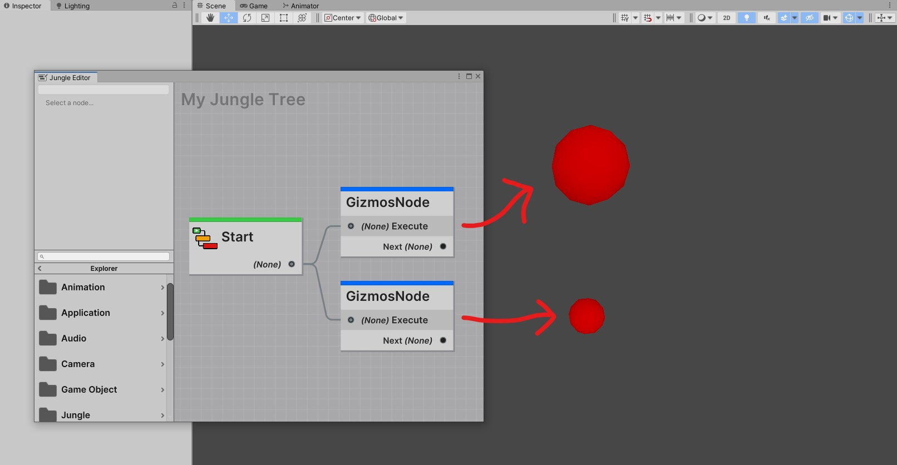

Unity provides a way to draw gizmos in the scene view. Gizmos are visual shapes and lines that can be used for debugging
and visualizing information in the scene view. Usually, this feature is only available in the `OnDrawGizmos` and 
`OnDrawGizmosSelected` methods within a `MonoBehaviour` class.

Luckily, Jungle provides a way to draw gizmos in the scene view all from within your node scripts.

:::tip NOTE
You can view gizmos in the game view by enabling the `Gizmos` toggle in the game view toolbar.

<ImagePresenter  />


:::

## How to Draw Gizmos

Drawing gizmos is as easy as overriding the `DrawGizmos` or `DrawGizmosSelected` methods in your node script.
Within either of these methods, you safely draw gizmos or handles in the scene view.

```csharp
using Jungle;

public class GizmosNode : GenericNode
{
    ...

    public override void DrawGizmos()
    {
        // Draws gizmos in the scene view when: 
        // - The node is open in the editor
        // - The tree this node is in is running
    }
    
    public override void DrawGizmosSelected()
    {
        // Draws gizmos in the scene view when:
        // - The node is selected in the editor
    }
}
```

### Example

Here's an example of a node that draws a red sphere in the scene view:

```csharp
using Jungle;
using UnityEngine;

public class GizmosNode : GenericNode
{
    [SerializeField]
    private Vector3 position = Vector3.zero;
    
    [SerializeField]
    private float radius = 1f;
    
    protected override void OnStart() { }

    protected override void OnUpdate() { }
    
    public override void DrawGizmos()
    {
        // Draws a red sphere at the origin
        Gizmos.color = Color.red;
        Gizmos.DrawSphere(position, radius);
    }
}
```

The example above will draw a red sphere at the specified position with the specified radius in the scene view whenever
the tree is open in the editor or when the tree is running.



Two red sphere are drawn to the scene view because there are two instances of the example above.
