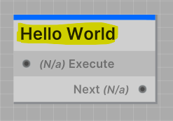
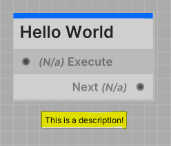
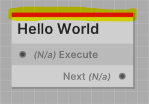

import VideoPlayer from '@site/src/components/VideoPlayer';

<VideoPlayer
    videoUrl="https://www.youtube.com/watch?v=DAyAZErFx7A"
    title="Creating Nodes"
    description="Here's a video tutorial on creating all node variants in Jungle."
/>

---

All Jungle Nodes require the class attribute `NodeProperties` to be defined.
The `NodeProperties` attribute is used to define various properties of the node script you created.

## Properties

| Property    | Type        | Notes                                                                |
|-------------|-------------|----------------------------------------------------------------------|
| Title       | string      | Defines the title of the node                                        |
| Description | string      | Documents the purpose of the node (Also used as a tooltip)           |
| Category    | string      | Defines the location in the node explorer to put this node           |
| Color       | string      | Defines the accent color of the node (Is a hex code)                 |
| Options     | NodeOptions | Flags representing different options that can be applied to the node |

---

### Title

The `Title` of the node is the name that will be displayed on the node in the Jungle Editor.

```csharp
[NodeProperties(
    Title = "Hello World"
)]
public class HelloWorldNode : IdentityNode
...
```



:::tip NOTE
The node title does not need to be unique.
:::

---

### Description

The `Description` of the node should be a brief explanation of what the node does. The description is also used as a tooltip when you hover over the node in the Jungle Editor.

```csharp
[NodeProperties(
    Description = "This is a description!"
)]
public class HelloWorldNode : IdentityNode
...
```



:::tip TIP
Node descriptions will also appear as tooltips when you hover over a node in the Jungle Editor.
:::

---

### Category

The `Category` property defines the location in the node explorer to put the node.

```csharp
[NodeProperties(
    Category = "Utility/General"
)]
public class HelloWorldNode : IdentityNode
...
```

---

### Color

The `Color` property defines the node's accent color.

```csharp
[NodeProperties(
    Color = JungleNode.Red
)]
public class HelloWorldNode : IdentityNode
...
```

#### OR

```csharp
[NodeProperties(
    Color = "#dc1313"
)]
public class HelloWorldNode : IdentityNode
...
```



Since memorizing a bunch of hex codes is ridiculous, Jungle provides predefined colors that you can use. The predefined colors are constant strings that reside in the `JungleNode` class:

- **Red**    #dc1313
- **Orange** #ff5b00
- **Yellow** #f29e06
- **Green**  #38ca42
- **Teal**   #15deab
- **Cyan**   #00eaff
- **Blue**   #0069ff
- **Purple** #b300ff
- **Pink**   #ff00ea
- **Violet** #85034c
- **White**  #ffffff
- **Black**  #101010

:::info
```csharp
// Will print "#dc1313" to the console
Debug.Log(JungleNode.Red);
```
:::

---

### Options

The `Options` property allows you to define specific behaviors for the node using flags from the `NodeOptions` enum.

- **RestartIfCalledWhileRunning**: Restart the node if it is called while already running.
- **OnlyAllowOneInstancePerTree**: Allow only one instance of the node per `JungleTree`.
- **HideInNodeExplorerAndConnectionLookup**: Hide the node in the Node Explorer and Connection Lookup.
- **Deprecated**: Marks the node as deprecated, hiding it from the Node Explorer and preventing new instances from being added to trees.

```csharp
[NodeProperties(
    Title = "My Node",
    Options = NodeOptions.RestartIfCalledWhileRunning | NodeOptions.Deprecated
)]
public class MyNode : IdentityNode
...
```

In this example:
- **RestartIfCalledWhileRunning**: The node will restart if called while already running.
- **Deprecated**: The node will be hidden from the Node Explorer and Connection Lookup and cannot be added to trees.

---

## Boilerplate

```csharp
[NodeProperties(
    Title = "My Node",
    Description = "Your friendly neighborhood node.",
    Category = "Nodes/My Node",
    Color = JungleNode.Blue,
    Options = NodeOptions.RestartIfCalledWhileRunning
)]
```

---

## Example

Here's an example of how you could define the `NodeProperties` for two nodes that control a door in your game.

```csharp
using Jungle;

[NodeProperties(
    Title = "Open Door",
    Description = "Opens the inputted door.",
    Category = "Game/Door",
    Color = JungleNode.Green
)]
public class OpenDoorNode : IONode<Door>
...
```

```csharp
using Jungle;

[NodeProperties(
    Title = "Close Door",
    Description = "Closes the inputted door.",
    Category = "Game/Door",
    Color = JungleNode.Red
)]
public class CloseDoorNode : IONode<Door>
...
```
