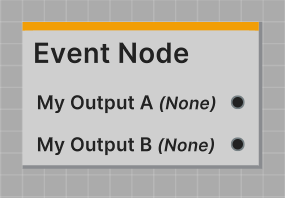
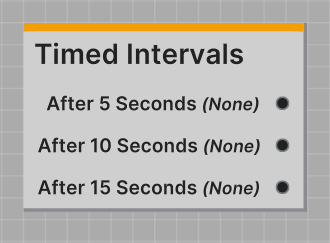

The Event Node is a powerful node type in Jungle. The Event Node has zero inputs and outputs to any number of outputs
that all can output any types.

Event Nodes are called when the Jungle Tree is started.

---

All Event Nodes are required to have a `EventNode` class attribute defined. This attribute defines the output ports on
the node.

Here's a list of all the properties you can define in the `EventNode` attribute:

| Property          | Type       | Description                              |
|-------------------|------------|------------------------------------------|
| `OutputPortNames` | `string[]` | Defines the names for each output port   |
| `OutputPortTypes` | `type[]`   | Defines the outputted type for each port |

The output port names and types should be defined in the same order and should always be the same length. You are
limited to 256 output ports per node.

Here's an example of a `EventNode` attribute:
```csharp
[EventNode(
    OutputPortNames = new string[] { "My Output A",     "My Output B" },
    OutputPortTypes = new Type[]   { typeof(Port.None), typeof(Port.None) }
)]
public class MyEventNode : EventNode
...
```

#### Result in the Jungle Editor



:::info WHERE IS THE INPUT TYPE DEFINED?
Simply put, **it's not**. The Event Node has no input ports, so an input type doesn't ever need to be defined.
:::

---
## Code Reference

**Namespace: `Jungle`**

### Properties

<span class="DocItemTitle">JungleTree</span>
<br />`public JungleTree JungleTree { get; }`
<br />_Reference to the nodes Jungle Tree._

<span class="DocItemTitle">OutputPorts</span>
<br />`public Port[] OutputPorts { get; }`
<br />_List of the nodes output ports._

<span class="DocItemTitle">IsRunning</span>
<br />`public bool IsRunning { get; }`
<br />_True if the node is currently running._

<span class="DocItemTitle">Nothing</span>
<br />`public static readonly Port.None Nothing`
<br />_Equivalent to new Port.None()._

---

<span class="DocItemTitle">GetTitle()</span>
<br />`public string GetTitle()`
<br />_Returns the nodes title._

<span class="DocItemTitle">GetDescription()</span>
<br />`public string GetDescription()`
<br />_Returns a brief description of the nodes function._

<span class="DocItemTitle">GetCategory()</span>
<br />`public string GetCategory()`
<br />_Returns the nodes category._

<span class="DocItemTitle">GetColor()</span>
<br />`public Color GetColor()`
<br />_Returns the nodes accent color._

<span class="DocItemTitle">GetIcon()</span>
<br />`public Texture GetIcon()`
<br />_Returns the nodes icon._

:::info EDITOR ONLY
Fetching the Jungle Nodes icon only works in the Unity editor. In a build, this will return a blank white texture.
:::

<span class="DocItemTitle">GetUid()</span>
<br />`public string GetUid()`
<br />_Returns the nodes unique id._

<span class="DocItemTitle">IsDeprecated()</span>
<br />`public bool IsDeprecated()`
<br />_Returns true if the node is declared deprecated._

<span class="DocItemTitle">GetInputPortInfo()</span>
<br />`public override Port.Info GetInputPortInfo()`
<br />_Returns info about the nodes input port._

<span class="DocItemTitle">GetOutputPortsInfo()</span>
<br />`public override Port.Info[] GetOutputPortsInfo()`
<br />_Returns info about the nodes output ports._

---
### Events

<span class="DocItemTitle">OnValidated</span>
<br />`public Action<bool> OnValidated`
<br />_Called when the node is validated. Callback is true if issues were detected._

---
### Methods

<span class="DocItemTitle">OnStart()</span>
<br />`protected abstract void OnStart()`
<br />_Called immediately when the Jungle Tree is started._

<span class="DocItemTitle">OnUpdate()</span>
<br />`protected abstract void OnUpdate()`
<br />_Called every frame while the node is running. Always called after **OnStart**._

:::info REQUIRED
Both **OnStart** and **OnUpdate** are required methods in all Jungle Nodes. Your code **will not** compile without them.
:::

<span class="DocItemTitle">OnStop()</span>
<br />`protected virtual void OnStop()`
<br />_Called immediately after this node is stopped._

<span class="DocItemTitle">GetDetails()</span>
<br />`public override string GetDetails()`
<br />_Override this and return the information you would like to display in the Jungle Editor._

<span class="DocItemTitle">OnValidation()</span>
<br />`protected virtual Issue[] OnValidation()`
<br />_Called whenever a validation pass is performed on this node. Return any issues in your script here to display
them inside the [Jungle Validator](/docs/using-the-editor/jungle-validator)._

---

<span class="DocItemTitle">CallAndStop(<span class="DocItemParameter">Port.Call[]</span>)</span> _or_
<span class="DocItemTitle">CallAndStop(<span class="DocItemParameter">Port.Call</span>)</span>
<br />1: `protected void CallAndStop(Port.Call[] calls)`
<br />2: `protected void CallAndStop(Port.Call call)`
<br />_Both sends port call(s) to the requested ports and stops the node._

<span class="DocItemTitle">Call(<span class="DocItemParameter">Port.Call[]</span>)</span> _or_
<span class="DocItemTitle">Call(<span class="DocItemParameter">Port.Call</span>)</span>
<br />1: `protected void Call(Port.Call[] calls)`
<br />2: `protected void Call(Port.Call call)`
<br />_Sends out port call(s) to the requested ports on this node._

<span class="DocItemTitle">Stop()</span>
<br />`protected void Stop()`
<br />_Stops the node without sending any port calls._

---
## Boilerplate

```csharp
using Jungle;

[NodeProperties(
    Title = "Event Node",
    Description = "No inputs, multiple outputs."
)]
[EventNode(
    OutputPortNames = new []{ "Output A",        "Output B"        },
    OutputPortTypes = new []{ typeof(Port.None), typeof(Port.None) }
)]
public class MyEventNode : EventNode
{
    protected override void OnStart()
    {
        CallAndStop(new []
        {
            new Port.Call(0, Nothing),
            new Port.Call(1, Nothing)
        });
    }
    
    protected override void OnUpdate() { }
}
```

---
## Example

Here's a simple example of an Event Node that calls different outputs at 5, 10, and 15 seconds intervals.

```csharp
using Jungle;
using UnityEngine;

[NodeProperties(
    Title = "Timed Intervals",
    Description = "Calls different outputs at 5, 10, and 15 seconds intervals.",
    Color = Yellow
)]
[EventNode(
    OutputPortNames = new string[] { "After 5 Seconds", "After 10 Seconds", "After 15 Seconds" },
    OutputPortTypes = new Type[]   { typeof(Port.None), typeof(Port.None),  typeof(Port.None)  }
)]
public class TimedIntervalsNode : EventNode
{
    private float _startTime;
    private bool _called5Seconds;
    private bool _called10Seconds;
    private bool _called15Seconds;
    
    protected override void OnStart()
    {
        _startTime = Time.time;
        
        _called5Seconds = false;
        _called10Seconds = false;
        _called15Seconds = false;
    }

    protected override void OnUpdate()
    {
        float elapsedTime = Time.time - _startTime;

        // After 5 seconds
        if (!_called5Seconds && elapsedTime >= 5)
        {
            Call(new Port.Call(0, new Port.None()));
            _called5Seconds = true;
        }
        
        // After 10 seconds
        if (!_called10Seconds && elapsedTime >= 10)
        {
            Call(new Port.Call(1, new Port.None()));
            _called10Seconds = true;
        }
        
        // After 15 seconds
        if (!_called15Seconds && elapsedTime >= 15)
        {
            CallAndStop(new Port.Call(2, new Port.None()));
            _called15Seconds = true;
        }
    }
}
```

As shown in the example above, the output ports are named **After 5 Seconds**, **After 10 Seconds**, and **After 15
Seconds** and all output **nothing**.

With this setup, the node will call the first output after 5 seconds, the second output after 10 seconds, and the third
output after 15 seconds.

This configuration is useful for creating timed events in your Jungle Tree.


