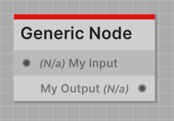
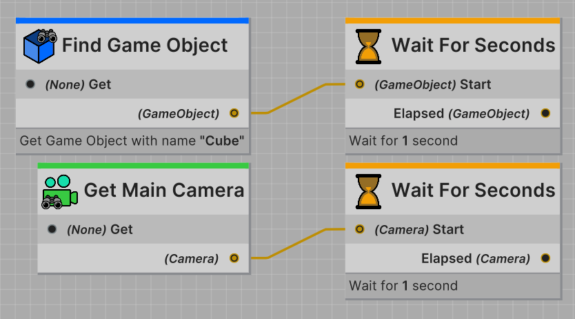
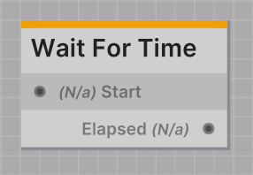

The identity node is the simplest node type in Jungle.
It takes a single input of any type, and outputs the inputted value without changing or mutating it.

This node type is useful for nodes that do not require an input to function.
**For instance**, a node that waits for a set amount of time before continuing.

:::tip TIP
The inputted value is stored internally and **cannot** be modified or changed.
:::

---

All identity nodes are required to have a `IdentityNode` class attribute defined.
This attribute defines the input port and output port on the node.

Here's a list of all the properties you can define in the `IdentityNode` attribute:

| Property          | Type     | Description                         |
|-------------------|----------|-------------------------------------|
| `InputPortName`   | `string` | Defines the name of the input port  |
| `OutputPortName`  | `string` | Defines the name of the output port |

```csharp
[IdentityNode(
    InputPortName = "My Input",
    OutputPortName = "My Output"
)]
public class MyIdentityNode : IdentityNode
...
```

#### Result in the Jungle Editor



:::info WHERE IS THE INPUT TYPE DEFINED?
The input port type is defined by any connected nodes output type.



The **Wait For Seconds** node seen above is an identity node.
<br />As you can see, both the **Find Game Object** node and the **Get Main Camera** node can be connected to the input
of the **Wait For Seconds** node.
:::

---
## Code Reference

**Namespace: `Jungle`**

### Properties

<span class="DocItemTitle">JungleTree</span>
<br />`public JungleTree JungleTree { get; }`
<br />_Reference to the nodes Jungle Tree._

<span class="DocItemTitle">OutputPorts</span>
<br />`public Port[] OutputPorts { get; }`
<br />_List of the nodes output ports._

<span class="DocItemTitle">IsRunning</span>
<br />`public bool IsRunning { get; }`
<br />_True if the node is currently running._

<span class="DocItemTitle">Nothing</span>
<br />`public static readonly Port.None Nothing`
<br />_Equivalent to new Port.None()._

---

<span class="DocItemTitle">GetTitle()</span>
<br />`public string GetTitle()`
<br />_Returns the nodes title._

<span class="DocItemTitle">GetDescription()</span>
<br />`public string GetDescription()`
<br />_Returns a brief description of the nodes function._

<span class="DocItemTitle">GetCategory()</span>
<br />`public string GetCategory()`
<br />_Returns the nodes category._

<span class="DocItemTitle">GetColor()</span>
<br />`public Color GetColor()`
<br />_Returns the nodes accent color._

<span class="DocItemTitle">GetIcon()</span>
<br />`public Texture GetIcon()`
<br />_Returns the nodes icon._

:::info EDITOR ONLY
Fetching the Jungle Nodes icon only works in the Unity editor. In a build, this will return a blank white texture.
:::

<span class="DocItemTitle">GetUid()</span>
<br />`public string GetUid()`
<br />_Returns the nodes unique id._

<span class="DocItemTitle">IsDeprecated()</span>
<br />`public bool IsDeprecated()`
<br />_Returns true if the node is declared deprecated._

<span class="DocItemTitle">GetInputPortInfo()</span>
<br />`public override Port.Info GetInputPortInfo()`
<br />_Returns info about the nodes input port._

<span class="DocItemTitle">GetOutputPortsInfo()</span>
<br />`public override Port.Info[] GetOutputPortsInfo()`
<br />_Returns info about the nodes output ports._

---
### Events

<span class="DocItemTitle">OnValidated</span>
<br />`public Action<bool> OnValidated`
<br />_Called when the node is validated. Callback is true if issues were detected._

---
### Methods

<span class="DocItemTitle">OnStart()</span>
<br />`protected abstract void OnStart()`
<br />_Called immediately when the node is called by another node._

<span class="DocItemTitle">OnUpdate()</span>
<br />`protected abstract void OnUpdate()`
<br />_Called every frame while the node is running. Always called after **OnStart**._

:::info REQUIRED
Both **OnStart** and **OnUpdate** are required methods in all Jungle Nodes. Your code **will not** compile without them.
:::

<span class="DocItemTitle">OnStop()</span>
<br />`protected virtual void OnStop()`
<br />_Called immediately after this node is stopped._

<span class="DocItemTitle">GetDetails()</span>
<br />`public override string GetDetails()`
<br />_Override this and return the information you would like to display in the Jungle Editor._

<span class="DocItemTitle">OnValidation()</span>
<br />`protected virtual Issue[] OnValidation()`
<br />_Called whenever a validation pass is performed on this node. Return any issues in your script here to display
them inside the [Jungle Validator](/docs/using-the-editor/jungle-validator)._

---

<span class="DocItemTitle">CallAndStop()</span>
<br />`protected void CallAndStop()`
<br />_Both sends out a port call and stops the node._

<span class="DocItemTitle">Call()</span>
<br />`protected void Call()`
<br />_Sends out a port call to the requested ports on this node._

<span class="DocItemTitle">Stop()</span>
<br />`protected void Stop()`
<br />_Stops the node without sending out a port call._

---
## Boilerplate

```csharp
using Jungle;

[NodeProperties(
    Title = "Identity Node",
    Description = "One input, one output."
)]
[IdentityNode(
    InputPortName = "Input",
    OutputPortName = "Output"
)]
public class MyIdentityNode : IdentityNode
{
    protected override void OnStart()
    {
        CallAndStop();
    }
    
    protected override void OnUpdate() { }
}
```

---
## Example

Here's a simple example of a identity node that waits for some time before continuing.

```csharp
using Jungle;

[NodeProperties(
    Title = "Wait For Time",
    Description = "One input, one output.",
    Color = Yellow
)]
[IdentityNode(
    InputPortName = "Start",
    OutputPortName = "Elapsed"
)]
public class WaitForTimeNode : IdentityNode
{
    [SerializeField]
    private float waitTime = 1f;

    private float _startTime;

    protected override void OnStart()
    {
        _startTime = Time.time;
    }
    
    protected override void OnUpdate() 
    { 
        if (Time.time - _startTime < waitTime)
            return;
        
        CallAndStop();
    }
}
```

As shown in the example above, the input port is named **Start** and accepts any type, and the output port is named
**Elapsed** and outputs the inputted type.

With this setup, when a node calls this node, the inputted value will be stored in the `WaitForTimeNode` internally and
outputted after the set amount of time has elapsed.

This configuration allows us to create a node that waits for a set amount of time before continuing.


