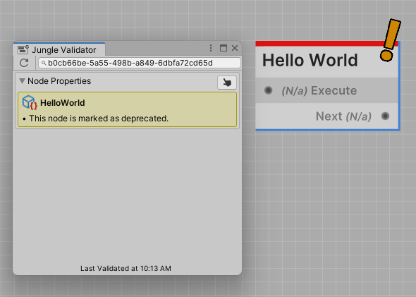

All Jungle Nodes require the class attribute `NodeProperties` to be defined.

The `NodeProperties` attribute is used to define the node script you created.

## Properties

| Name                              | Type    | Notes                                                                  |
|-----------------------------------|---------|------------------------------------------------------------------------|
| Title                             | string  | Defines the title of the node                                          |
| Description                       | string  | Documents the purpose of the node (Also used as a tooltip)             |
| Category                          | string  | Defines the location in the node explorer to put this node             |
| Color                             | string  | Defines the accent color of the node. Is a **Hex Code**                |
| Deprecated                        | boolean | Set this to true to declare this node as deprecated                    |
| ShouldRestartIfCalledWhileRunning | boolean | Determines whether the node should restart if called while its running |

---
### Title

The `Title` of the node is the name that will be displayed on the node in the Jungle Editor.

:::info NOTE
Your node's title doesn't need to be unique.
:::

```csharp
[NodeProperties(
    Title = "Hello World"
)]
public class HelloWorldNode : GenericNode
...
```


**Here's the recommended naming pattern:**

Lets say you have a script in your game that controls a door named **DoorController.cs** that you would
like to build nodes for. Here's how you could define the title for an **Open Door** node.

```csharp
[NodeProperties(
    Title = "Open Door"
)]
public class OpenDoorNode : IONode<Door>
...
```

:::tip TIP
Scripts that inherit from any Jungle Node type should have the word **Node** at the end of its class name. This is not
required but is a great naming pattern to follow.
:::

---
### Description

The `Description` of the node should be a brief explanation of what the node does. The description is also used as a
tooltip when you hover over the node in the Jungle Editor.

```csharp
[NodeProperties(
    // Other properties...
    Description = "This is a description!"
)]
public class HelloWorldNode : GenericNode
...
```


:::tip TIP
Node descriptions will also appear as tooltips when you hover over a node in the Jungle Editor.
:::

---
### Category

The `Category` property defines the location in the node explorer to put the node.

---
### Color

The `Color` property defines the nodes accent color.

```csharp
[NodeProperties(
    // Other properties...
    Color = Red // Or any hex code
)]
public class HelloWorldNode : GenericNode
...
```


:::info INFO
The color property takes a **hex code**. You can use any hex code you want.
:::

Since we know that nobody wants to remember hex codes, Jungle has a list of predefined colors that you can use.

#### Colors

- **Red**    #dc1313
- **Orange** #ff5b00
- **Yellow** #f29e06
- **Green**  #38ca42
- **Teal**   #15deab
- **Cyan**   #00eaff
- **Blue**   #0069ff
- **Purple** #b300ff
- **Pink**   #ff00ea
- **Violet** #85034c
- **White**  #ffffff
- **Black**  #101010

```csharp
var redHexCode = JungleNode.Red;
Debug.Log(redHexCode); // Would print "#dc1313" to the console
```

---
### Deprecated

The `Deprecated` property provides a way to mark nodes that you no longer want to be add-able to trees.

```csharp
[NodeProperties(
    // Other properties...
    Deprecated = true
)]
public class HelloWorldNode : GenericNode
...
```



:::tip TIP
You should only declare the `Deprecated` property if you want to mark a node as deprecated.
<br />**The property defaults to false.**
:::

Setting the deprecated node property to true will do two things:
- The node will throw a validation issue
- The node will be hidden in the node explorer

This makes it easy to identify and remove deprecated nodes from your trees.

:::danger DANGER
**NEVER** delete a node script from your project until it has been removed from all trees.
:::

---
### ShouldRestartIfCalledWhileRunning

The `ShouldRestartIfCalledWhileRunning` property determines whether the node should restart if called while its running.

- **True**: The node will restart if called while its running
- **False**: The node will ignore the call and continue running

:::tip TIP
You should only declare the `ShouldRestartIfCalledWhileRunning` property if you want the restart behavior.
<br />**The property defaults to false.**
:::

---
## Boilerplate

```csharp
[NodeProperties(
    Title = "My Node",
    Description = "This is the description of My Node",
    Category = "Nodes/My Node",
    Color = Blue,
    Deprecated = false     // Not required to be defined (defaults to false)
)]
```

### Example

Let's put everything together now and define the node properties for the door example above.

```csharp
[NodeProperties(
    Title = "Open Door",
    Description = "Opens the inputted door.",
    Category = "Game/Door",
    Color = Green
)]
public class OpenDoorNode : IONode
...
```

```csharp
[NodeProperties(
    Title = "Close Door",
    Description = "Closes the inputted door.",
    Category = "Game/Door",
    Color = Red
)]
public class CloseDoorNode : IONode
...
```
