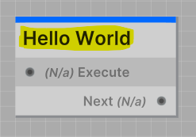
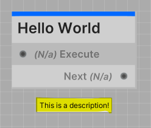
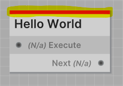

All Jungle Nodes require the class attribute `NodeProperties` to be defined.
The `NodeProperties` attribute is used to define the node script you created.

## Properties

| Property                    | Type    | Notes                                                                  |
|-----------------------------|---------|------------------------------------------------------------------------|
| Title                       | string  | Defines the title of the node                                          |
| Description                 | string  | Documents the purpose of the node (Also used as a tooltip)             |
| Category                    | string  | Defines the location in the node explorer to put this node             |
| Color                       | string  | Defines the accent color of the node (Is a hex code)                   |
| Deprecated                  | boolean | Set this to true to declare this node as deprecated                    |
| RestartIfCalledWhileRunning | boolean | Determines whether the node should restart if called while its running |

---
### Title

The `Title` of the node is the name that will be displayed on the node in the Jungle Editor.

```csharp
[NodeProperties(
    Title = "Hello World"
)]
public class HelloWorldNode : IdentityNode
...
```



:::tip NOTE
The node title does not need to be unique.
:::

---
### Description

The `Description` of the node should be a brief explanation of what the node does.
The description is also used as a tooltip when you hover over the node in the Jungle Editor.

```csharp
[NodeProperties(
    Description = "This is a description!"
)]
public class HelloWorldNode : IdentityNode
...
```



:::tip TIP
Node descriptions will also appear as tooltips when you hover over a node in the Jungle Editor.
:::

---
### Category

The `Category` property defines the location in the node explorer to put the node.

---
### Color

The `Color` property defines the nodes accent color.

```csharp
[NodeProperties(
    Color = Red
)]
public class HelloWorldNode : IdentityNode
...
```

#### OR

```csharp
[NodeProperties(
    Color = "#dc1313"
)]
public class HelloWorldNode : IdentityNode
...
```



Since memorizing a bunch of hex codes is ridiculous, Jungle has a couple of predefined colors that you can use.
The predefined colors are constant strings that reside in the `JungleNode` class.

- **Red**    #dc1313
- **Orange** #ff5b00
- **Yellow** #f29e06
- **Green**  #38ca42
- **Teal**   #15deab
- **Cyan**   #00eaff
- **Blue**   #0069ff
- **Purple** #b300ff
- **Pink**   #ff00ea
- **Violet** #85034c
- **White**  #ffffff
- **Black**  #101010

:::info
```csharp
// Will print "#dc1313" to the console
Debug.Log(JungleNode.Red);
```
:::

---
### Deprecated

The `Deprecated` property provides a way to mark nodes that you no longer want to be add-able to trees.

- **True**: The node will throw a validation issue and be hidden in the node explorer
- **False**: The node will be add-able and visible in the node explorer

```csharp
[NodeProperties(
    Deprecated = true
)]
public class HelloWorldNode : IdentityNode
...
```

:::info
You should only declare the `Deprecated` property if you want to mark a node as deprecated.
<br />**By default, the property is false.**
:::

---
### RestartIfCalledWhileRunning

The `RestartIfCalledWhileRunning` property determines whether the node should restart if called while its running.

- **True**: The node will restart if called while its running
- **False**: The node will ignore the call and continue running

```csharp
[NodeProperties(
    RestartIfCalledWhileRunning = true
)]
public class HelloWorldNode : IdentityNode
...
```

:::info
You should only declare the `RestartIfCalledWhileRunning` property if you want the restart behavior.
<br />**By default, the property is false.**
:::

---
## Boilerplate

```csharp
[NodeProperties(
    Title = "My Node",
    Description = "Your friendly neighborhood node.",
    Category = "Nodes/My Node",
    Color = Blue,
    Deprecated = false,                 // (OPTIONAL)
    RestartIfCalledWhileRunning = false // (OPTIONAL)
)]
```

---
## Example

Here's an example of how you could define the `NodeProperties` for two nodes that control a door in your game.

```csharp
[NodeProperties(
    Title = "Open Door",
    Description = "Opens the inputted door.",
    Category = "Game/Door",
    Color = Green
)]
public class OpenDoorNode : IONode<Door>
...
```

```csharp
[NodeProperties(
    Title = "Close Door",
    Description = "Closes the inputted door.",
    Category = "Game/Door",
    Color = Red
)]
public class CloseDoorNode : IONode<Door>
...
```
