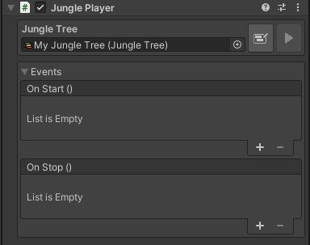

Jungle comes with a simple built-in player component that you can use to play trees.
The player will automatically play the assigned Jungle Tree on start.

:::tip NOTE
The Jungle Player is **NOT** the only way to play trees.
The player is simply a helpful component to get you started quickly.
:::

---
## Events

The player component also has two Unity Events:
- **On Start:** Invoked when the tree starts playing
- **On Stop:** Invoked when the tree stops playing

---
## Implementing the Player

There are two ways to create a player component:

### Adding the Player from a Tree

You can create a player component for a tree by dragging the tree file from the assets folder into the scene view.
This will create a game object in the scene named after the tree file with the Jungle Player component attached.

### Adding the Player Manually

You can manually add the Jungle Player component to any game object in the scene and assign a tree to it.
