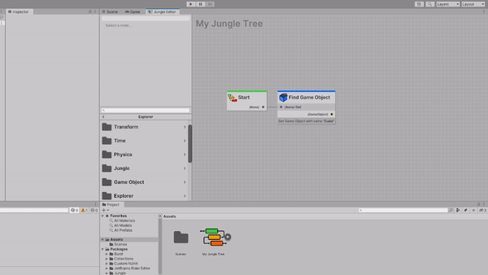
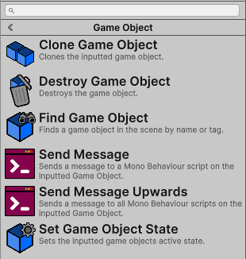
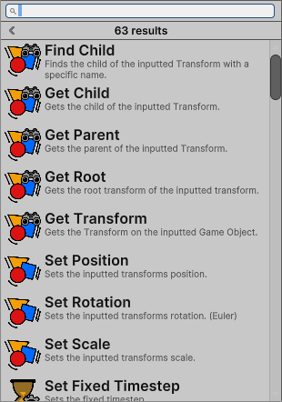

The node explorer is where you find nodes to add to your graph.

---
## Explorer Categories

The node explorer is organized into defined categories. 

You should organize your nodes into categories that make sense for your project. Categories can be as many folders deep
as you want.

Your node's category is defined in the `NodeProperties` attribute. 
Read more about that **[here](../../jungle-nodes/node-properties#category)**.

---
## Adding My Nodes to the Explorer

Any nodes you create will automatically be added to the node explorer.

The second your node compiles, it will be **search-able** and **add-able** from the node explorer.

---
## Searching for Nodes

The search bar at the top of the node explorer allows you to search for nodes by name. 
The searches are not case-sensitive.

:::tip TIP
If you would like to display all nodes in the explorer on one page, type a space into the search bar.

:::
