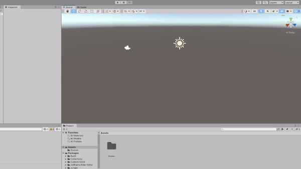
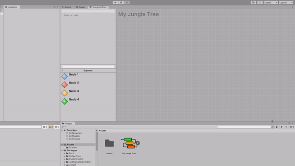
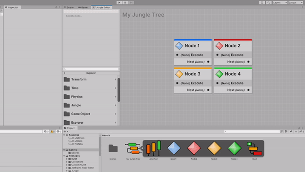
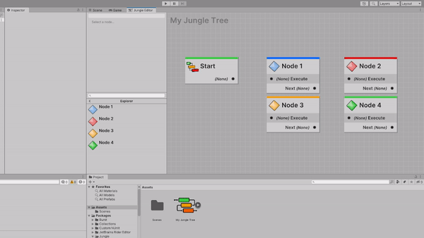
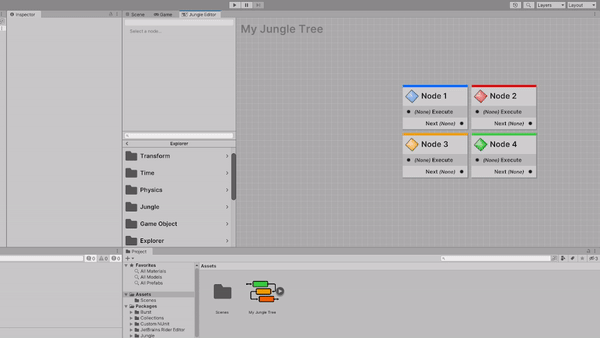

The node graph is where you assemble your sequences.

## Opening the Editor

**Double-click** on a Jungle Tree in your assets folder. This will open the Jungle Tree in the editor.

## Nodes

Nodes are the visual representation of your code. They are the building blocks of your trees. Literally.

### Adding Nodes
8

To add a node to the graph, **left-click** and **drag** the node from the node explorer you want to add. 

:::info NODE EXPLORER
Read more about the node explorer **[here](jungle-editor-node-explorer)**.
:::

### Selecting Nodes

Selecting elements can be done two ways:
- [Selecting them manually](#select-with-cursor)
- [Drawing a selection box](#select-with-box)

#### Select With Cursor

You can select a node by **left-clicking** on it. 

You can select multiple nodes by holding **Alt** and **left-click** on each additional node you want to select.

#### Select With Box

**Left-click** and **drag** to draw a selection box. All nodes within the box will be selected.

:::tip TIP
You can append to your selections by holding **Alt** while drawing the selection box.
:::

### Connecting Nodes

Connecting nodes together is how you create your sequences. To connect nodes, **left-click** and **drag** from the port
of one node to the port of another node. 

:::info RULES
- You can only connect ports of the same type together
- You can only connect inputs to outputs and vice versa
:::

## Sticky Notes

Sticky notes are a great way to document and organize your trees.

| Action   | Shortcut          | Context Menu                   |
|----------|-------------------|--------------------------------|
| Add Note | **Shift** + **S** | **Right Click** > **Add Note** |

This will add a sticky note to your graph at your mouse cursor.

:::tip USING STICKY NOTES AS GROUPS 
If you add a note while selecting nodes, the note will surround all the selected nodes. 
This is a great way to group nodes together.
:::

### Moving and Resizing Sticky Notes

Sticky notes can be moved around the graph just like nodes. You can also resize them by dragging on the sides or 
corners. 

### Editing Sticky Notes

To edit the text of a sticky note, double-click on it.

### Sticky Note Themes

You can change the color of a sticky note by right clicking on it, hovering over **Theme**, and selecting the color you
want.

### Locking/Unlocking Sticky Notes

If you would like to lock the sticky note in place, you can right click on it and select **Lock**. This will prevent
you from accidentally moving, resizing, or editing the note.

## Input

### Controls

| Action        | Input             |
|---------------|-------------------|
| Pan Graph     | Middle Mouse      | 
| Zoom Graph    | Scroll Wheel      |
| Selection Box | Left Click + Drag |

:::tip PANNING WITH OTHER DEVICES
If you're using the Jungle Editor on your laptop/tablet, you can pan the graph by holding **Alt** and dragging with
your _trackpad_, _stylus_, or _finger_.
:::

### Shortcuts

| Action         | Shortcut | Context Menu                |
|----------------|----------|-----------------------------|
| Select All     | Ctrl + A | Right Click > Select All    |
| Copy           | Ctrl + C | Right Click > Copy          |
| Paste          | Ctrl + V | Right Click > Paste         |
| Duplicate      | Ctrl + D | Right Click > Duplicate     |
| Delete         | Del      | Right Click > Delete        |
| Frame All      | A        | _None_                      |
| Frame Origin   | O        | Right Click > Recenter View |
| Frame Next     | ]        | _None_                      |
| Frame Previous | [        | _None_                      |
