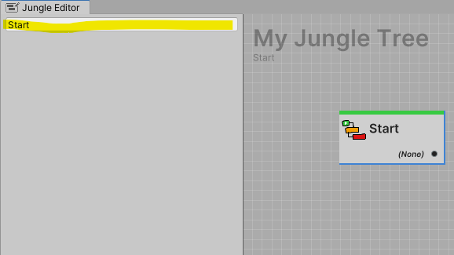

The node inspector is where you edit the properties of your nodes.

---
## Opening a Node in the Inspector

The node inspector automatically displays the properties of the most recently selected node.

:::info NO MULTIPLE SELECTION EDITING SUPPORT
**Currently**, the node inspector does not support editing multiple nodes at once.
:::

---
## Renaming Nodes

You can rename nodes using the text input at the top of the inspector. The name does not need to be unique.

All nodes automatically are given a unique name when they are created. 

:::info NAME REQUIREMENTS
The name of a node must be at least **one** character long.
:::

---
## Custom Node Inspectors

Custom node inspectors are a powerful way to extend the functionality of your nodes.
Building inspectors for nodes works the same way as building inspectors for `MonoBehaviour`'s and `ScriptableObject`'s.

Read more about custom node inspectors **[here](../../../docs/jungle-nodes/advanced/custom-node-inspectors)**.
