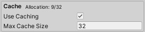

:::info
The Jungle Cache has exposed API, but it is **not** recommended you call any methods on it directly.
:::

The Jungle Cache is a system designed to speed up the Jungle Editor. The cache itself is never built to the application.

The Jungle Cache is a singleton instance. It can be accessed with `JungleCache.instance`.

---
It includes two systems, the icon cache, and the Jungle Tree cache. 

_Q:_ **Why cache the Jungle Nodes icons?**
<br />_A:_ Because caching the icons significantly improves the performance of the Jungle Editor.

_Q:_ **Why cache the Jungle Trees?**
<br />_A:_ This is not used for performance, but rather as a MUCH easier solution to fetching a list of all Jungle Trees
in the project.

---
## Jungle Icon Cache

Jungle has a smart caching system under the hood designed to speed up the Jungle Editors load time. The cache is smart
and is rebuilt (if needed) each time your project is recompiled. The cache is always the absolute minimum size possible
so that system memory is never wasted.

The system groups nodes and icons together in a container. Since multiple Jungle Nodes will usually share a common icon,
this case is automatically detected and will associate the icon with all the Jungle Nodes while only caching the icon
once. This ensures the cache is as small as possible while also being as a performant as possible.

### Options

The Jungle Cache can be disabled in the Jungle Preferences window.
- **Window/Jungle/Preferences/Open**



As seen above, the Jungle Cache has two options, enabling and disabling of the system, and the max cache size.

#### Use Caching

By disabling the cache, you will lose the performance of having the icons preloaded into your system memory, but will
also decrease the amount of memory used.

:::info RUNNING OUT OF MEMORY?
Instead of disabling the cache, try turning the max cache size down. Also make sure the icons you use are not extremely
large.
:::

#### Max Cache Size

The max cache size is default set to 32. This should provide you with plenty of space for more icons. If you need more
space, always feel free to crank that number up. _Having a massive cache size can cause the Unity Editor to crash from 
to insufficient system memory._

**Max Cache Size recommendations:**

| Memory         | Max Cache Size  |
|----------------|-----------------|
| 4gb            | _Disable Cache_ |
| 8gb            | 16              |
| 16gb           | 32              |
| 32gb           | 64              |
| 64gb _or more_ | 128             |

Do note that the absolute maximum size the cache can be is **128**.

### API

:::danger
The Jungle Cache API was exposed explicitly for the Jungle Editor systems that rely on it. **Calling the API is highly
discouraged**.
:::

:::warning EDITOR ONLY
These methods only work in the Unity Editor. 
:::

```csharp
using Jungle;
```

Builds the Jungle Cache.
```csharp
public void BuildIconCache()
```

Clears the Jungle Cache.
```csharp
public void ClearIconCache()
```

Fetches a types icon from the icon cache. 
<br />_If the requested type could not be found in the icon cache, the icon will instead be loaded directly._
```csharp
public Texture TryGetIconFromCache(Type type)
```

The amount of allocated icons in the Jungle Cache.
```csharp
public int GetCacheAllocationSize()
```

## Jungle Tree Cache

The Jungle Tree cache was implemented to keep a reference to all Jungle Trees in the project at all times. This is used
by systems such as the Jungle Validator which needs a persistent list of Jungle Trees to function.

### API

:::warning EDITOR ONLY
These methods only work in the Unity Editor.
:::

Clears the Jungle Cache.
```csharp
public void ClearIconCache()
```
