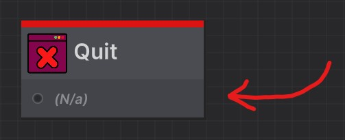

Learning how to create your own nodes is a crucial part of using Jungle.
This guide will walk you through the process of creating a new node in each variant.

It's recommended you read the [Concepts](/docs/concepts) page before continuing.

#### LEGO Analogy

Think of nodes as LEGO blocks. Each block is a small piece of a larger set. Each block should be able to be used in as
many different sets as possible. This is the same for nodes. Each node should be able to be used in as many trees as 
possible.

If a LEGO block was too specific and only makes sense in a single set, it wouldn't be very useful.
The same goes for nodes. Always make sure to split your tasks into separate, more modular and reusable nodes.

---
## Node Variants

Jungle has four node variants to choose from. Each variant has its own unique use case, but they all work the same way.

Choosing the right variant for your node is important. Here's a quick overview of each variant:
- **Branch Node:** A node with one input and multiple outputs.
- **IO Node:** A node with one input and one output.
- **Identity Node:** A node with one input and one output, but the input and output type can be anything.
- **Event Node:** A node with no inputs and multiple outputs.

#### But What if I Want More Than One Input?

If your node needs multiple inputs, more than likely, you're likely using Jungle in the wrong way. Due to how the Jungle
runtime works, as soon as a node is started, all port call data should be available.

While it would be totally possible to implement another parameter to the `OnStart` method that could explicitly mark the
inputted data and mark which input it came from, this would make Jungle more of a visual scripter than a sequencer.

:::tip PASSING MULTIPLE VALUES THROUGH A SINGLE PORT
If you just want to pass multiple values through the same port, you can always just use a
**[Tuple](https://learn.microsoft.com/en-us/dotnet/csharp/language-reference/builtin-types/value-tuples)**
:::

## Creating a Node

Nodes are simply just C# scripts. The visual appearance of the node is defined in attributes added to the class.
Jungle will automatically detect your node scripts and visualize them in the editor.

Here are the steps to creating each node variant:

---
### Identity Node

- **Step 1:** Create a new C# script and name it whatever you want.
    - It's recommended to add a "Node" suffix to the script name. (Ex: `BlahBlahNode.cs`).

- **Step 2:** Inherit from the `IdentityNode` class.
```csharp
using Jungle;

public class MyIdentityNode : IdentityNode // <-- Inherit from IdentityNode
{

}
```

- **Step 3:** Implement the `OnStart` and `OnUpdate` method.
```csharp
using Jungle;

public class MyIdentityNode : IdentityNode
{
    // --------------------------------
    protected override void OnStart()
    {
        // Implement the OnStart method
    }

    protected override void OnUpdate()
    {
        // Implement the OnUpdate method
    }
    // --------------------------------
}
```

- **Step 4:** Add the `IdentityNode` attribute to the class.
    - This attribute is used to define the input and output port names.
    - The `InputPortName` and `OutputPortName` properties are optional.
```csharp
using Jungle;

// --------------------------------
[IdentityNode(
    InputPortName = "My Input",
    OutputPortName = "My Output"
)]
// --------------------------------
public class MyIdentityNode : IdentityNode
{
    protected override void OnStart()
    {

    }

    protected override void OnUpdate()
    {

    }
}
```

:::tip DON'T WANT THE OUTPUT PORT?
You can define the `OutputPortName` property as null if you want to remove the output port.
```csharp
using Jungle;

[IdentityNode(
    InputPortName = "",
    OutputPortName = null
)]
public class QuitNode : IdentityNode
...
```

:::


- **Step 5:** Add the `NodeProperties` attribute to the class.
```csharp
using Jungle;

// --------------------------------
[NodeProperties(
    Title = "My Identity Node",
    Description = "This is an identity node.",
    Category = "My Nodes/Identity",
    Color = Green
)]
// --------------------------------
[IdentityNode(
    InputPortName = "My Input",
    OutputPortName = "My Output"
)]
public class MyIdentityNode : IdentityNode
{
    protected override void OnStart()
    {

    }

    protected override void OnUpdate()
    {

    }
}
```

---
### IO Node

- **Step 1:** Create a new C# script and name it whatever you want.
  - It's recommended to add a "Node" suffix to the script name. (Ex: `BlahBlahNode.cs`).

---
### Branch Node

- **Step 1:** Create a new C# script and name it whatever you want.
  - It's recommended to add a "Node" suffix to the script name. (Ex: `BlahBlahNode.cs`).

---
### Event Node

- **Step 1:** Create a new C# script and name it whatever you want.
  - It's recommended to add a "Node" suffix to the script name. (Ex: `BlahBlahNode.cs`).
