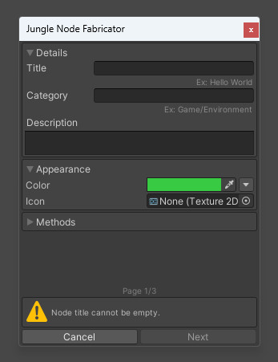

Learning how to create your own nodes is a crucial part of using Jungle.
This guide will walk you through the process of creating a new node in each variant.

---
## LEGO® Analogy

In a LEGO® set, each block is a small piece of a larger set.
Each block is designed to be reused in as many sets as possible.
The more versatile a block is, the more useful it is.
The same goes for nodes. Each node should be a small piece of a larger task.
Each node should be able to be used in as many trees as possible.

If a LEGO® block is too specific and only makes sense in a single set, it wouldn't be very useful.
The same goes for nodes. Always make sure to split your tasks into separate, more modular and reusable nodes.

<small>
    LEGO® is a trademark of the LEGO Group, which does not sponsor or endorse this site.
    LEGO references are purely illustrative.
</small>

---
## Node Variants

Jungle has four node variants to choose from. Each variant has its own unique use case, but they all work the same way.
Choosing the right variant for your node is very important. Below is a quick overview of each variant.

| Variant       | Description                                                                                  |
|---------------|----------------------------------------------------------------------------------------------|
| Identity Node | A single input and a single output, except the input port type is defined by its connection. |
| IO Node       | A single input and a single output.                                                          |
| Branch Node   | A single input and multiple outputs.                                                         |
| Event Node    | No inputs but multiple outputs.                                                              |

---
## Using the Node Fabricator

Jungle comes with a tool for generating the boilerplate code for each node variant.



- **Step 1:** Open the Node Fabricator window.
    - Right-click in the Assets window and select `Create > Jungle Node`.

- **Step 2:** (Page 1) Set the properties for the node.
    - _Title:_ The title of the node. This will be the class name. (Ex: "Hello World" becomes `HelloWorldNode`)
    - _Description:_ A brief description of the node.
    - _Category:_ The category of the node.
    - _Color:_ The color of the node.
    - _Icon:_ The icon of the node.
    - _Methods_: The methods to include in the generated script.

- **Step 3:** (Page 2) Select the node variant you want to create.
    - <a href="/docs/jungle-nodes/identity-node" target="_blank" rel="noopener noreferrer">Identity Node</a>
    - <a href="/docs/jungle-nodes/io-node" target="_blank" rel="noopener noreferrer">IO Node</a>
    - <a href="/docs/jungle-nodes/branch-node" target="_blank" rel="noopener noreferrer">Branch Node</a>
    - <a href="/docs/jungle-nodes/event-node" target="_blank" rel="noopener noreferrer">Event Node</a>

- **Step 4:** (Page 3) Set the properties for the selected node variant.

- **Step 5:** Click the `Create` button to generate the node script.

---
## Creating Nodes Manually

You can also create nodes manually if you prefer to do so.
Below are the steps to create each node variant.

### Identity Node

- **Step 1:** Create a new C# script.

- **Step 2:** Inherit the new class from the `IdentityNode` class.
```csharp
using Jungle;

//                            ↓↓↓↓↓↓↓↓↓↓↓↓
public class MyIdentityNode : IdentityNode
{

}
```

- **Step 3:** Implement the `OnStart` and `OnUpdate` method.
```csharp
using Jungle;

public class MyIdentityNode : IdentityNode
{
    //                      ↓↓↓↓↓↓↓
    protected override void OnStart()
    {

    }

    //                      ↓↓↓↓↓↓↓↓
    protected override void OnUpdate()
    {

    }
}
```

- **Step 4:** Add the `IdentityNode` attribute to the class.
    - This attribute is used to define the input and output port names.
    - The `InputPortName` and `OutputPortName` properties are optional.
    - :::tip
        If you don't want an output port, set the `OutputPortName` property null. (`OutputPortName = null`)
      :::
```csharp
using Jungle;

// ↓↓↓↓↓↓↓↓↓↓
[IdentityNode(
    InputPortName = "My Input",
    OutputPortName = "My Output"
)]
public class MyIdentityNode : IdentityNode
{
    protected override void OnStart()
    {

    }

    protected override void OnUpdate()
    {

    }
}
```

- **Step 5:** Add the `NodeProperties` attribute to the class.
```csharp
using Jungle;

// ↓↓↓↓↓↓↓↓↓↓↓↓
[NodeProperties(
    Title = "My Identity Node",
    Description = "This is an identity node.",
    Category = "My Nodes/Identity",
    Color = Green
)]
[IdentityNode(
    InputPortName = "My Input",
    OutputPortName = "My Output"
)]
public class MyIdentityNode : IdentityNode
{
    protected override void OnStart()
    {

    }

    protected override void OnUpdate()
    {

    }
}
```

---
### IO Node

- **Step 1:** Create a new C# script.

- **Step 2:** Inherit the new class from the `IONode<T>` class.
```csharp
using Jungle;

//                      ↓↓↓↓↓↓
public class MyIONode : IONode<...>
{

}
```

- **Step 3:** Set the accepted input port type in the angle brackets. (Ex: `IONode<int>`)
```csharp
using Jungle;

//                             ↓↓↓↓↓↓↓↓↓↓
public class MyIONode : IONode<INPUT_TYPE>
{

}
```

- **Step 4:** Implement the `OnStart` and `OnUpdate` method.
    - Ensure you include the input parameter in the `OnStart` method.
```csharp
using Jungle;

public class MyIONode : IONode<INPUT_TYPE>
{
    protected override void OnStart(INPUT_TYPE inputValue)
    {

    }

    protected override void OnUpdate()
    {

    }
}
```

- **Step 5:** Add the `IONode` attribute to the class.
    - This attribute is used to define the input and output port names.
    - The `InputPortName` and `OutputPortName` properties are optional.
    - :::tip
        If you don't want an output port, set the `OutputPortName` and `OutputPortType` property null.
        <br />(`OutputPortName = null` and `OutputPortType = null`)
      :::
```csharp
using Jungle;

// ↓↓↓↓↓↓↓↓↓
[IONode(
    InputPortName = "My Input",
    OutputPortName = "My Output",
    OutputPortType = typeof(OUTPUT_TYPE)
)]
public class MyIONode : IONode<INPUT_TYPE>
{
    protected override void OnStart(INPUT_TYPE inputValue)
    {

    }

    protected override void OnUpdate()
    {

    }
}
```

- **Step 6:** Add the `NodeProperties` attribute to the class.
```csharp
using Jungle;

// ↓↓↓↓↓↓↓↓↓↓↓↓
[NodeProperties(
    Title = "My IO Node",
    Description = "This is an IO node.",
    Category = "My Nodes/IO",
    Color = Green
)]
[IONode(
    InputPortName = "My Input",
    OutputPortName = "My Output",
    OutputPortType = typeof(OUTPUT_TYPE)
)]
public class MyIONode : IONode<INPUT_TYPE>
{
    protected override void OnStart(INPUT_TYPE inputValue)
    {

    }

    protected override void OnUpdate()
    {

    }
}
```

---
### Branch Node


---
### Event Node


