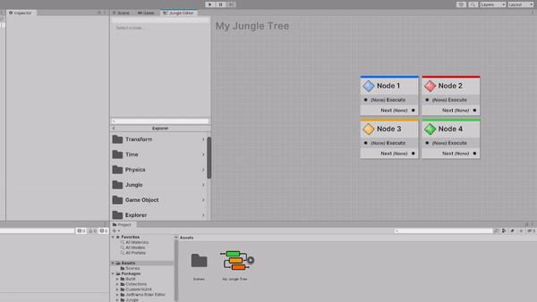

import VideoPlayer from '@site/src/components/VideoPlayer';

<VideoPlayer
    videoUrl="https://youtu.be/ng1zW2k6WlM"
    title="Sticky Notes"
    description="Here's a video about how to use sticky notes in the Jungle Editor!"
/>

---

Sticky notes are a great way to document and organize your trees.

---

| Action   | Shortcut          | Context Menu                   |
|----------|-------------------|--------------------------------|
| Add Note | **Shift** + **S** | **Right Click** > **Add Note** |

This will add a sticky note to your graph at your mouse cursor.

:::tip USING STICKY NOTES AS GROUPS
If you add a note while selecting nodes, the note will surround all the selected nodes.
This is a great way to group nodes together.
:::

### Moving and Resizing Sticky Notes

Sticky notes can be moved around the graph just like nodes. You can also resize them by dragging on the sides or
corners.

### Editing Sticky Notes

To edit the text of a sticky note, double-click on it.

### Sticky Note Themes

You can change the color of a sticky note by right clicking on it, hovering over **Theme**, and selecting the color you
want.

### Locking/Unlocking Sticky Notes

If you would like to lock the sticky note in place, you can right click on it and select **Lock**. This will prevent
you from accidentally moving, resizing, or editing the note.

