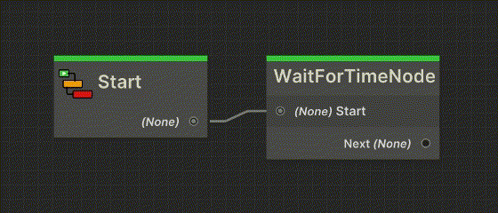

import VideoPlayer from '@site/src/components/VideoPlayer';

<VideoPlayer
    videoUrl="https://youtu.be/o2w7lS7snig"
    title="Context and Node Customization"
    description="Here's a video tutorial on implementing context and customizing you nodes."
/>

---
Jungle's editor allows you to implement custom visual context elements on your nodes.
This is useful for displaying additional information without requiring the developer to manually select the node.

## Details Box

The details box is a simple way to display additional information about a node.
The box is displayed on the bottom of the node. The text can be dynamic and is updated on every validation pass.

To implement a details box on your node, you need to override the `GetDetails` method.
This method should return a string with the text to be displayed.

Below is an example of a node that waits for a certain amount of time.
The details box displays the time that the node will wait for.


```csharp
using Jungle;
using UnityEngine;

public class WaitForTimeNode : IdentityNode
{
    [SerializeField]
    private float time = 1f;

    private float _startTime;

    protected override void OnStart()
    {
        _startTime = Time.time;
    }

    protected override void OnUpdate()
    {
        if (Time.time - _startTime >= time)
        {
            CallAndStop();
        }
    }

    // ----------------------------------------------------------
    public override string GetDetails()
    {
        // Return the text to be displayed in the details box.
        return $"Wait for {time} seconds";
    }
    // ----------------------------------------------------------
}
```

---
## Progress Bar

The progress bar is a visual element that can be used to display the progress of a node.
The progress bar is the colored accent at the top of the node.
The progress bar is updated on every frame that the node is running.

To implement a progress bar on your node, you need to override the `GetProgress` method.
This method should return a float value between 0 and 1, representing the progress of the node.

Below is an example of a node that waits for a certain amount of time.
The progress bar displays the progress of the node, based on the time that has passed.



```csharp
using Jungle;
using UnityEngine;

public class WaitForTimeNode : IdentityNode
{
    [SerializeField]
    private float time = 1f;

    private float _startTime;

    protected override void OnStart()
    {
        _startTime = Time.time;
    }

    protected override void OnUpdate()
    {
        if (Time.time - _startTime >= time)
        {
            CallAndStop();
        }
    }

    // ----------------------------------------------------------
    public override float GetProgress()
    {
        // Return the progress of the node. This value should be between 0 and 1.
        return Mathf.Clamp01((Time.time - _startTime) / time);
    }
    // ----------------------------------------------------------
}
```

---
## Control Panel

The control panel allows you to draw IMGUI elements directly inside nodes in the Jungle Editor.
