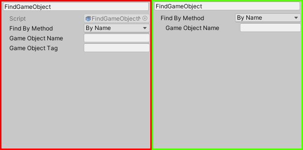

Building custom node inspectors is a great way to add custom functionality to your nodes. **Creating custom node
inspectors works exactly like building custom inspectors for Mono Behaviours and Scriptable Objects.**

## Creating a Custom Inspector

### Introduction

A custom inspector is a class that inherits from `UnityEditor.Editor`. This class is then attached to your Jungle Node
script using the `UnityEditor.CustomEditor` attribute.

```csharp
[UnityEditor.CustomEditor(typeof(MyClass))]
public class MyEditor : UnityEditor.Editor
{
    // Editor code here
}
```

:::warning
All editor classes should be placed between `#if UNITY_EDITOR` and `#endif` tags to ensure that the editor code is
stripped from the build. If you do not do this, your build will **fail**.
:::

### Tutorials

Here's a manual by Unity on how to create custom inspectors in Unity:
<br />[Unity Custom Inspector Manual](https://docs.unity3d.com/Manual/UIE-HowTo-CreateCustomInspector.html)

**OR**

Check out this Brackeys tutorial on how to create custom inspectors in Unity.
<iframe width="560" height="315" src="https://www.youtube.com/embed/RInUu1_8aGw?si=BumBO-eNUEd13JzZ" title="YouTube video player" frameborder="0" allow="accelerometer; autoplay; clipboard-write; encrypted-media; gyroscope; picture-in-picture; web-share" allowfullscreen></iframe>

## Implementation

Jungle will automatically detect and implement your custom inspector into the Jungle Editor.

Custom inspectors are by no means required but can help boost your workflow and make your nodes more user-friendly. All
built-in Jungle nodes have custom inspectors that make the nodes look cleaner and easier to use.

No custom inspector **(Red)** _Vs._ custom inspector **(Green)**:


### Example

Here's an example of a custom inspector for a node that inherits from `GenericNode`. This inspector displays a property 
field for the `value` property.

The #if UNITY_EDITOR tag ensures that the editor code is stripped from the build.

```csharp
using Jungle;
using UnityEngine;
#if UNITY_EDITOR
using UnityEditor;
#endif

[NodeProperties(
    Title = "My Node",
    Description = "You friendly neighborhood node.",
    Category = "My Nodes",
    Color = Blue
)]
[GenericNode(
    InputPortName = "Start",
    OutputPortName = "Next"
)]
public class MyNode : GenericNode
{
    [SerializeField] 
    private float value = 1f;
    
    protected override void OnStart()
    {
        CallAndStop();
    }

    protected override void OnUpdate() { }
}

// Use the UNITY_EDITOR tag ensures that the editor code is stripped from the build
#if UNITY_EDITOR
[CustomEditor(typeof(MyNode))]
public class MyNodeEditor : UnityEditor.Editor
{
    private SerializedProperty _value;
    
    private void OnEnable()
    {
        _value = serializedObject.FindProperty("value");
    }

    public override void OnInspectorGUI()
    {
        serializedObject.Update();
        
        EditorGUILayout.PropertyField(_value);
        
        serializedObject.ApplyModifiedProperties();
    }
}
#endif
```
