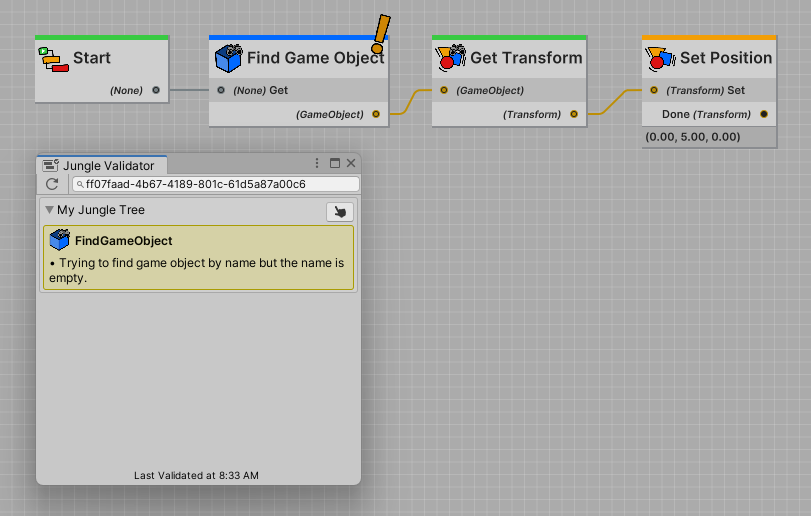
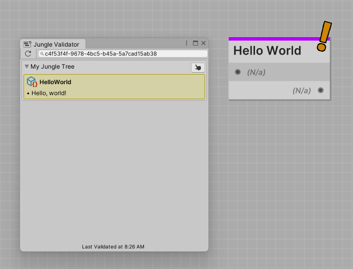

Declaring validations is a simple process. All Jungle Nodes have a `OnValidation()` method that you can override. This
method is called when a validation pass is performed on the node. 

You can use this method to declare your own validation issues.

:::note NOTE
Validation passes are only performed in the editor. All validation systems are stripped from builds.
:::

## Declaring Validation Issues

The `OnValidation()` method returns a `string[]` array. Each string in the array is a validation issue.

If the array is empty, then the node has no validation issues.

```csharp
protected override string[] OnValidation()
{
    return new[]
    {
        "Issue 1",
        "Issue 2",
        "Issue 3"
    };
}
```

**You can declare as many validation issues as you want.**

## Reading Validation Issues

Here's a simple sequence that moves a game object to a position.



But the `FindGameObject` node has a validation issue (indicated by the warning icon).
You can see that the detected issue is that the game object name/tag to search for is empty.

This would mean that when the sequence ran, the `FindGameObject` node would fail to find a game object and the sequence
would fail.

**Validation issues help you to catch errors without having to run the sequence.**

## Example

```csharp
using Jungle;

[NodeProperties(
    Title = "Hello World",
    Color = Purple
)]
[GenericNode(
    InputPortName = "",
    OutputPortName = ""
)]
public class HelloWorldNode : GenericNode
{
    // Node implementation removed for simplicity...
    
    protected override string[] OnValidation()
    {
        return new[]
        {
            "Hello, world!"
        };
    }
}
```

The example above declares a validation issue with the message "Hello, world!".



When open the Jungle Editor, you'll see a warning icon on the node. This indicates that the node has validation issues.
**Click the warning icon** to open and highlight the issue in the validation editor.
