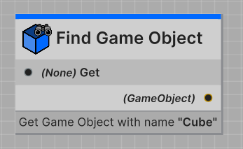
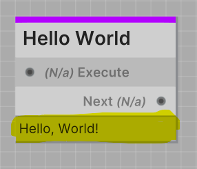

Editor context simply refers to information reflected into the editor from your nodes. 
This is useful for things like showing the current value of a node, or the current state of a node.

:::tip TIP
Providing too much information in the editor can be overwhelming.
**Be careful to only display information that is useful.**
:::

## Node Details

When you want to display information about a node in the editor, you can very easily override the `GetDetails` method
in your node class. This method returns a `string` which is then displayed in the editor under your node.

This box is great for display information to the developer without requiring them to click anything. 
It's as simple as looking and reading.

The **Find Game Object** node is a great example of how to effectively use node details. 
As you can see, the box is used to display what game object the node will try to find when it runs.



Without selecting the node at all, the developer can see what game object the node will try to find.

---

:::info EXAMPLE
```csharp
[NodeProperties(
    Title = "Hello World",
    Color = Purple
)]
public class HelloWorldNode : GenericNode
{
    protected override void OnStart() { }

    protected override void OnUpdate() { }

    public override string GetDetails()
    {
        return "Hello, World!";
    }
}
```

#### Result in Editor


:::
