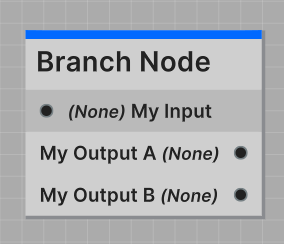
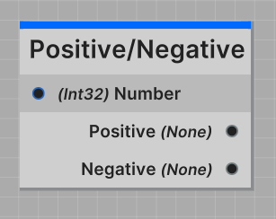

The Branch Node is the most powerful node type in Jungle. The Branch Node takes a single input of any type, and outputs
to any number of outputs that all can output any types.

:::tip ONLY NEED ONE OUTPUT?
If you plan to use only a single output from the branch node, we recommend building an **IO Node** instead.
:::

---

All Branch Nodes are required to have a `BranchNode` class attribute defined. This attribute defines the input port
and output ports on the node.

Here's a list of all the properties you can define in the `BranchNode` attribute:

| Name               | Type       | Notes                                    |
|--------------------|------------|------------------------------------------|
| `InputPortName`    | `string`   | Defines the name of the input port       |
| `OutputPortNames`  | `string[]` | Defines the names for each output port   |
| `OutputPortTypes`  | `type[]`   | Defines the outputted type for each port |

The output port names and types should be defined in the same order and should always be the same length. You are 
limited to 256 output ports per node.

Here's an example of a `BranchNode` attribute:
```csharp
[BranchNode(
    InputPortName = "My Input",
    OutputPortNames = new []{ "My Output A",     "My Output B"     },
    OutputPortTypes = new []{ typeof(Port.None), typeof(Port.None) }
)]
public class MyBranchNode : BranchNode<Port.None>
...
```

#### Result in the Jungle Editor


:::info HOW DO I DEFINE THE INPUT PORT TYPE?
The Branch Node is a generic class, so you define the input port type when you inherit from the class. 
<br />**For example**, if you want the input port to accept a `float` value, you would set your script up like so:
```csharp
public class MyBranchNode : BranchNode<float>
...
```
:::

---
## Code Reference

**Namespace: `Jungle`**

### Properties

<span class="DocItemTitle">JungleTree</span>
<br />`public JungleTree JungleTree { get; }`
<br />_Reference to the nodes Jungle Tree._

<span class="DocItemTitle">OutputPorts</span>
<br />`public Port[] OutputPorts { get; }`
<br />_List of the nodes output ports._

<span class="DocItemTitle">IsRunning</span>
<br />`public bool IsRunning { get; }`
<br />_True if the node is currently running._

<span class="DocItemTitle">Nothing</span>
<br />`public static readonly Port.None Nothing`
<br />_Equivalent to new Port.None()._

---

<span class="DocItemTitle">GetTitle()</span>
<br />`public string GetTitle()`
<br />_Returns the nodes title._

<span class="DocItemTitle">GetDescription()</span>
<br />`public string GetDescription()`
<br />_Returns a brief description of the nodes function._

<span class="DocItemTitle">GetCategory()</span>
<br />`public string GetCategory()`
<br />_Returns the nodes category._

<span class="DocItemTitle">GetColor()</span>
<br />`public Color GetColor()`
<br />_Returns the nodes accent color._

<span class="DocItemTitle">GetIcon()</span>
<br />`public Texture GetIcon()`
<br />_Returns the nodes icon._

:::info EDITOR ONLY
Fetching the Jungle Nodes icon only works in the Unity editor. In a build, this will return a blank white texture.
:::

<span class="DocItemTitle">GetUid()</span>
<br />`public string GetUid()`
<br />_Returns the nodes unique id._

<span class="DocItemTitle">IsDeprecated()</span>
<br />`public bool IsDeprecated()`
<br />_Returns true if the node is declared deprecated._

<span class="DocItemTitle">GetInputPortInfo()</span>
<br />`public override Port.Info GetInputPortInfo()`
<br />_Returns info about the nodes input port._

<span class="DocItemTitle">GetOutputPortsInfo()</span>
<br />`public override Port.Info[] GetOutputPortsInfo()`
<br />_Returns info about the nodes output ports._

---
### Events

<span class="DocItemTitle">OnValidated</span>
<br />`public Action<bool> OnValidated`
<br />_Called when the node is validated. Callback is true if issues were detected._

---
### Methods

<span class="DocItemTitle">OnStart(<span class="DocItemParameter">in T</span>)</span>
<br />`protected abstract void OnStart(in T inputValue)`
<br />_Called immediately when the node is called by another node. The input value is the value sent by the calling 
node._

<span class="DocItemTitle">OnUpdate()</span>
<br />`protected abstract void OnUpdate()`
<br />_Called every frame while the node is running. Always called after **OnStart**._

:::info REQUIRED 
Both **OnStart** and **OnUpdate** are required methods in all Jungle Nodes. Your code **will not** compile without them.
:::

<span class="DocItemTitle">OnStop()</span>
<br />`protected virtual void OnStop()`
<br />_Called immediately after this node is stopped._

<span class="DocItemTitle">GetDetails()</span>
<br />`public override string GetDetails()`
<br />_Override this and return the information you would like to display in the Jungle Editor._

<span class="DocItemTitle">OnValidation()</span>
<br />`protected virtual Issue[] OnValidation()`
<br />_Called whenever a validation pass is performed on this node. Return any issues in your script here to display 
them inside the [Jungle Validator](/docs/using-the-editor/jungle-validator)._

---

<span class="DocItemTitle">CallAndStop(<span class="DocItemParameter">Port.Call[]</span>)</span> _or_
<span class="DocItemTitle">CallAndStop(<span class="DocItemParameter">Port.Call</span>)</span>
<br />1: `protected void CallAndStop(Port.Call[] calls)`
<br />2: `protected void CallAndStop(Port.Call call)`
<br />_Both sends port call(s) to the requested ports and stops the node._

<span class="DocItemTitle">Call(<span class="DocItemParameter">Port.Call[]</span>)</span> _or_
<span class="DocItemTitle">Call(<span class="DocItemParameter">Port.Call</span>)</span>
<br />1: `protected void Call(Port.Call[] calls)`
<br />2: `protected void Call(Port.Call call)`
<br />_Sends out port call(s) to the requested ports on this node._

<span class="DocItemTitle">Stop()</span>
<br />`protected void Stop()`
<br />_Stops the node without sending any port calls._

---
## Boilerplate

```csharp
using Jungle;

[NodeProperties(
    Title = "Branch Node",
    Description = "One input, multiple outputs.",
    Category = "Boilerplate",
    Color = Blue
)]
[BranchNode(
    InputPortName = "Input",
    OutputPortNames = new []{ "Output A",        "Output B"        },
    OutputPortTypes = new []{ typeof(Port.None), typeof(Port.None) }
)]
public class MyBranchNode : BranchNode<Port.None>
{
    protected override void OnStart(in Port.None inputValue)
    {
        CallAndStop(new []
        {
            new Port.Call(0, Nothing),
            new Port.Call(1, Nothing)
        });
    }
    
    protected override void OnUpdate() { }
}
```

---
## Example

Here's a simple example of a branch node that takes in a number and outputs weather the number is positive or negative.

```csharp
using Jungle;

[NodeProperties(
    Title = "Positive/Negative",
    Description = "Outputs weather the input is positive or negative."
)]
[BranchNode(
    InputPortName = "Number",
    OutputPortNames = new []{ "Positive",        "Negative" },
    OutputPortTypes = new []{ typeof(Port.None), typeof(Port.None) }
)]
public class PositiveNegativeNode : BranchNode<int>
{
    protected override void OnStart(in int number)
    {
        if (number >= 0)
        {
            // Call the positive port
            CallAndStop(new Port.Call(0, Nothing));
        }
        else
        {
            // Call the negative port
            CallAndStop(new Port.Call(1, Nothing));
        }
    }
    
    protected override void OnUpdate() { }
}
```

As seen in the example above, the input port would be named **Number** and accept type **int**. Also defined is the two 
output ports named **Positive** and **Negative** that output nothing.

With this setup, when a node calls this node, it will send a value of type **int** to the **Number** port. The node will
then check if the number is greater than or equal to zero. If it is, it will call the **Positive** port. If it's not, 
it will call the **Negative** port.

This gives us a node with branching logic that could run different sequences based on if the inputted number is positive
or negative.


