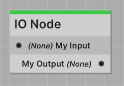
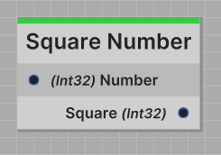

The IO Node is a simpler version of the Branch Node. It takes a single input of any type, and outputs to a single output
of any type.

---

All IO Nodes are required to have an `IONode` class attribute defined. This attribute defines the input port and
output port on the node.

Here's a list of all the properties you can define in the `IONode` attribute:

| Property         | Type     | Description                          |
|------------------|----------|--------------------------------------|
| `InputPortName`  | `string` | Defines the name of the input port.  |
| `OutputPortName` | `string` | Defines the name of the output port. |
| `OutputPortType` | `Type`   | Defines the ports outputted type.    |

```csharp
[IONode(
    InputPortName = "My Input",
    OutputPortName = "My Output",
    OutputPortType = typeof(Port.None)
)]
public class MyIONode : IONode<Port.None>
...
```

#### Result in the Jungle Editor


:::info WHERE IS THE INPUT TYPE DEFINED?
The IO Node is a generic class, so you define the input port type when you inherit from the class.
<br />**For example**, if you want the input port to accept a `float` value, you would set your script up like so:
```csharp
public class MyIONode : IONode<float>
...
```
:::

---
## Code Reference

**Namespace: `Jungle`**

### Properties

<span class="DocItemTitle">JungleTree</span>
<br />`public JungleTree JungleTree { get; }`
<br />_Reference to the nodes Jungle Tree._

<span class="DocItemTitle">OutputPorts</span>
<br />`public Port[] OutputPorts { get; }`
<br />_List of the nodes output ports._

<span class="DocItemTitle">IsRunning</span>
<br />`public bool IsRunning { get; }`
<br />_True if the node is currently running._

<span class="DocItemTitle">Nothing</span>
<br />`public static readonly Port.None Nothing`
<br />_Equivalent to new Port.None()._

---

<span class="DocItemTitle">GetTitle()</span>
<br />`public string GetTitle()`
<br />_Returns the nodes title._

<span class="DocItemTitle">GetDescription()</span>
<br />`public string GetDescription()`
<br />_Returns a brief description of the nodes function._

<span class="DocItemTitle">GetCategory()</span>
<br />`public string GetCategory()`
<br />_Returns the nodes category._

<span class="DocItemTitle">GetColor()</span>
<br />`public Color GetColor()`
<br />_Returns the nodes accent color._

<span class="DocItemTitle">GetIcon()</span>
<br />`public Texture GetIcon()`
<br />_Returns the nodes icon._

:::info EDITOR ONLY
Fetching the Jungle Nodes icon only works in the Unity editor. In a build, this will return a blank white texture.
:::

<span class="DocItemTitle">GetUid()</span>
<br />`public string GetUid()`
<br />_Returns the nodes unique id._

<span class="DocItemTitle">IsDeprecated()</span>
<br />`public bool IsDeprecated()`
<br />_Returns true if the node is declared deprecated._

<span class="DocItemTitle">GetInputPortInfo()</span>
<br />`public override Port.Info GetInputPortInfo()`
<br />_Returns info about the nodes input port._

<span class="DocItemTitle">GetOutputPortsInfo()</span>
<br />`public override Port.Info[] GetOutputPortsInfo()`
<br />_Returns info about the nodes output ports._

---
### Events

<span class="DocItemTitle">OnValidated</span>
<br />`public Action<bool> OnValidated`
<br />_Called when the node is validated. Callback is true if issues were detected._

---
### Methods

<span class="DocItemTitle">OnStart(<span class="DocItemParameter">in T</span>)</span>
<br />`protected abstract void OnStart(in T inputValue)`
<br />_Called immediately when the node is called by another node. The input value is the value sent by the calling
node._

<span class="DocItemTitle">OnUpdate()</span>
<br />`protected abstract void OnUpdate()`
<br />_Called every frame while the node is running. Always called after **OnStart**._

:::info REQUIRED
Both **OnStart** and **OnUpdate** are required methods in all Jungle Nodes. Your code **will not** compile without them.
:::

<span class="DocItemTitle">OnStop()</span>
<br />`protected virtual void OnStop()`
<br />_Called immediately after this node is stopped._

<span class="DocItemTitle">GetDetails()</span>
<br />`public override string GetDetails()`
<br />_Override this and return the information you would like to display in the Jungle Editor._

<span class="DocItemTitle">OnValidation()</span>
<br />`protected virtual Issue[] OnValidation()`
<br />_Called whenever a validation pass is performed on this node. Return any issues in your script here to display
them inside the [Jungle Validator](/docs/using-the-editor/jungle-validator)._

---

<span class="DocItemTitle">CallAndStop(<span class="DocItemParameter">object</span>)</span>
<br />`protected void CallAndStop(object outputValue)`
<br />_Both sends the output value to all nodes connected to the node and stops the node._

<span class="DocItemTitle">Call(<span class="DocItemParameter">object</span>)</span>
<br />`protected void Call(object outputValue)`
<br />_Sends the output value to all nodes connected to this node's output._

<span class="DocItemTitle">Stop()</span>
<br />`protected void Stop()`
<br />_Stops the node without sending a port call._

---
## Boilerplate

```csharp
using Jungle;

[NodeProperties(
    Title = "IO Node",
    Description = "One input, one output."
)]
[IONode(
    InputPortName = "Input",
    OutputPortName = "Output",
    OutputPortType = typeof(Port.None)
)]
public class MyIONode : IONode<Port.None>
{
    protected override void OnStart(in Port.None _)
    {
        CallAndStop(Nothing);
    }
    
    protected override void OnUpdate() { }
}
```

---
## Example

Here's a simple example of an IO Node that squares the inputted number.

```csharp
using Jungle;

[NodeProperties(
    Title = "Square Number",
    Description = "Squares a the inputted number.",
    Color = Green
)]
[IONode(
    InputPortName = "Number",
    OutputPortName = "Square",
    OutputPortType = typeof(int)
)]
public class SquareNumberNode : IONode<int>
{
    protected override void OnStart(in int number)
    {
        CallAndStop(number * number);
    }
    
    protected override void OnUpdate() { }
}
```

As shown in the example above, the input port is named **Number** and accepts the type **int**. Also defined is the 
output named **squared** which outputs type **int**.

With this setup, what a node calls this node, the inputted value is squared and outputted to the **Squared** port.


